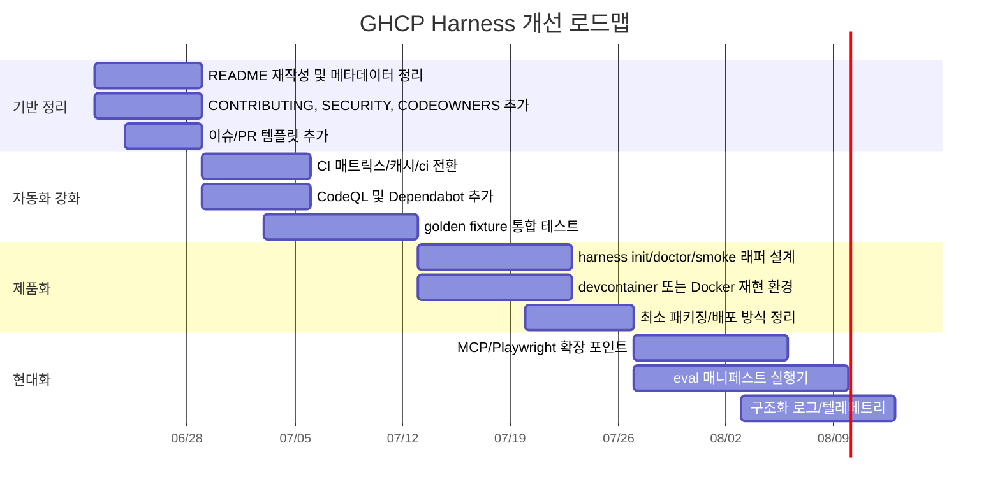

# GHCP Harness 저장소 심층 리뷰 보고서

## 경영 요약

이 저장소는 **“새로운 에이전트 런타임을 만들지 않고, GitHub Copilot의 커스텀 에이전트·instructions·skills·hooks만으로 계획→구현→검증→완료를 거버넌스로 강제하는 하네스”**라는 목표를 매우 선명하게 구현하고 있습니다. README, 기능 문서, 설계 문서, `feature_list.json`, 훅, `/finish`, `harness-doctor`, 스모크 테스트까지의 연결이 잘 맞물려 있고, 특히 **단일 always-on 규칙 파일**, **보호 경로 가드**, **상태 변경 단일 경로**, **문서↔구현 드리프트 감지**라는 설계 축은 작지만 강한 시스템으로 잘 정리되어 있습니다. 이는 단순 프롬프트 모음이 아니라, 명시적 운영 모델을 가진 “정책 레이어”라는 점에서 강점이 분명합니다. citeturn34view0turn34view1turn32view6turn32view7turn32view8turn15view0turn36view1

다만 현재 상태는 **“훌륭한 내부 설계 레포지토리”**에 더 가깝고, **“누가 가져다 바로 쓰는 오픈소스 하네스 제품”**으로 보기에는 배포·설치·재현성·보안·기여 흐름·관측성 계층이 얇습니다. README가 명시하듯 이 저장소는 설치형 프로그램이 아니고, `.github/` 자산과 몇 개의 스크립트를 복사하는 방식으로 적용됩니다. 또한 로컬 훅 강제는 VS Code Agent hooks Preview에 의존하고, 클라우드 에이전트용 원격 강제·sandbox guardrail은 아직 future roadmap으로 남아 있습니다. 저장소 메타데이터도 description, website, topics가 비어 있고, packages는 0이며, 태그는 1개뿐입니다. citeturn34view0turn34view4turn33view0turn33view1

가장 중요한 권고는 다섯 가지입니다. 첫째, **설치/도입 UX를 “복사형”에서 “초기화형(init)”으로 전환**해야 합니다. 둘째, **CI를 매트릭스·캐시·정적검사·보안검사까지 확장**해야 합니다. 셋째, **SECURITY.md, Dependabot, CodeQL, CODEOWNERS, 이슈/PR 템플릿**으로 공개 협업의 기본 골격을 추가해야 합니다. 넷째, **재현 가능한 개발 환경**을 제공해야 합니다. 다섯째, **현대 코딩 에이전트 생태계의 표준으로 자리잡는 MCP, 멀티에이전트 비교, 샌드박스, 평가 매니페스트, 텔레메트리**를 선택적으로 수용할 수 있는 확장 지점을 마련해야 합니다. 이러한 방향은 GitHub Copilot의 커스텀 에이전트·skills·hooks 공식 기능, Aider의 repo map·자동 lint/test, OpenHands·SWE-agent·Open SWE의 샌드박스/원격 실행, PR-Agent의 PR 중심 자동화, 최근 GitHub Agent HQ와 MCP 흐름과도 일치합니다. citeturn25search0turn25search6turn25search12turn25search15turn30view2turn37search0turn37search1turn30view0turn37search17turn37search2turn30view4turn30view5turn37search9turn38search2turn38search4turn38search11turn38search17

## 저장소 현황과 강점

저장소 루트에는 `.github`, `docs`, `examples`, `sandbox`, `scripts`, `tests`, `README.md`, `feature_list.json`, `LICENSE`가 있으며, `.github` 내부에는 `agents`, `hooks`, `instructions`, `prompts`, `skills`, `workflows`, `copilot-instructions.md`가 정리되어 있습니다. 이 구조는 단순하지만 목적이 명확합니다. 정책은 `.github/` 아래에, 근거 문서는 `docs/`에, 거버넌스 검사는 `scripts/`에, 순수 테스트는 `tests/`에, dogfood 앱은 `sandbox/`에 배치되어 있어 “설계-강제-검증-시연”의 흐름이 읽기 쉽습니다. citeturn34view0turn39view0turn11view0turn11view1turn11view2turn11view3turn11view4turn11view5turn11view6turn11view7

가장 인상적인 점은 **운영 철학이 코드와 문서에 동시에 심어져 있다는 점**입니다. 기능 문서는 Plan·Build·Ask·Explore의 역할 분리, Agent hooks, 보호 경로, 상태 거버넌스, 단일 always-on 파일, 자기 진단을 현재 동작 기준으로 정리하고 있고, 설계 문서는 왜 그렇게 했는지의 근거를 남겨 둡니다. 특히 `.github/copilot-instructions.md`와 `AGENTS.md`를 동시에 두지 않는 방침, `feature_list.json`을 canonical state로 둔 방침, `/finish`를 상태 변경 단일 경로로 강제하는 방침은 “컨텍스트 낭비”와 “운영 드리프트”를 동시에 줄이는 설계입니다. citeturn8view6turn8view7turn32view6turn32view7turn8view8turn14view7turn10view0

에이전트 설계도 의도적입니다. `Plan`은 읽기 전용 탐색과 계획 수립, `Build`는 구현과 검증, `Ask`는 가벼운 Q&A, `Explore`는 사용자 직접 호출이 불가능한 read-only 서브에이전트로 정의되어 있습니다. 이는 GitHub Copilot/VS Code가 제공하는 custom agents와 handoff 모델을 잘 활용한 구조이며, 한국어 공식 문서가 설명하는 “사용자 지정 에이전트 + 서브에이전트로 메인 컨텍스트를 보호”라는 방향과도 맞닿아 있습니다. citeturn14view0turn14view1turn14view2turn14view3turn26search0turn25search1turn25search6

거버넌스 구현 역시 강합니다. `protect-paths.mjs`는 `feature_list.json`, `.github/copilot-instructions.md`, `docs/05-decision-log.md`, `.github/hooks/`에 대해 `deny` 또는 `ask` 규칙을 적용하고, `validate-docs.mjs`는 깨진 상대 링크만 비차단 경고로 처리해 과발화를 피하며, `verify-done.mjs`는 `feature_list.json`이 미커밋이면 종료를 막고 하네스 자산 변경 시 `harness-doctor`를 재실행하여 드리프트를 차단합니다. README와 기능 문서가 설명하는 보호 경로·상태 거버넌스·자기 진단이 실제 스크립트로 이어진다는 점이 이 레포의 핵심 완성도입니다. citeturn15view1turn36view2turn36view1turn32view6turn32view7turn32view8

또 하나의 장점은 **dogfooding**입니다. `sandbox/task-cli`와 `sandbox/expense-cli`가 모두 독립적인 TypeScript+vitest CLI 예제로 존재하고, 루트 `smoke.mjs`는 `sandbox/*`의 테스트를 일괄 실행하는 경량 센서 역할을 합니다. `task-cli`와 `expense-cli` 모두 도메인 로직과 파일 영속화 어댑터, CLI 진입점을 분리하고 있으며, 테스트도 클래스 단위의 순수 로직 검증에 초점을 맞추고 있습니다. 하네스 저장소 치고는 “말만 하는 설계서”가 아니라 실제 작은 앱으로 마찰을 관찰하는 점이 좋습니다. citeturn17view0turn17view1turn8view4turn20view0turn20view2turn20view3turn21view0turn20view1turn20view4turn20view5turn22view0

## 영역별 진단

아래 표는 요청하신 검토 범위를 기준으로 현재 상태를 요약한 것입니다.

| 영역 | 현재 상태 | 평가 | 근거 |
|---|---|---|---|
| 저장소 구조 | 루트와 `.github/`의 역할 분리가 명확하고, docs/scripts/tests/sandbox 흐름이 읽기 쉬움 | **강점** | citeturn34view0turn39view0turn11view0turn11view1turn11view2turn11view3turn11view4turn11view5turn11view6turn11view7 |
| README | 목적, Quick Start, 문서 맵, 설계 핵심, non-goals는 좋음. 다만 스크린샷, 호환성 매트릭스, “새 프로젝트/기존 프로젝트/클라우드 에이전트”별 도입 경로, troubleshooting 인덱스는 부족 | **중상** | citeturn34view0turn34view1turn34view2turn34view3turn34view4 |
| 코드 품질 | Node built-in 위주로 단순하고 읽기 쉬움. 규칙 스크립트도 목적이 좁아 유지보수성이 좋음. 반면 루트 수준 lint/format/typecheck 규약은 보이지 않음 | **중상** | citeturn15view0turn15view1turn36view1turn36view2turn14view4turn14view5turn14view6 |
| 테스트 | 루트 훅 순수 로직 테스트와 샌드박스 앱 도메인 테스트는 있음. 하지만 hook lifecycle 통합 테스트, VS Code/GHCP 적재 테스트, golden fixture 테스트, 회귀 snapshot은 보이지 않음 | **중** | citeturn8view5turn21view0turn22view0turn32view8 |
| CI/CD | 단일 workflow가 `harness-doctor`, `node --test`, sandbox deps 설치, smoke를 수행함. 그러나 Node 20 단일 버전, 캐시 없음, `npm install` 사용, 보안 스캔 없음, 잡 분리 없음 | **중하** | citeturn35view0turn36view0 |
| 보안 | 레포 내부 거버넌스 보안은 좋음. 그러나 공개 OSS 운영 관점의 `SECURITY.md`, CodeQL, Dependabot, CODEOWNERS, 보안 템플릿은 파일 구조상 보이지 않음. 저장소 설정 기반 기능은 공개 페이지로는 unspecified | **중하** | citeturn15view1turn36view1turn39view0turn28search2turn28search3turn28search4turn29search2turn29search7 |
| 라이선스 | MIT 라이선스 명시. 공개용 라이선스 선택은 적절 | **양호** | citeturn7view9turn34view0 |
| 의존성 관리 | 하네스 루트는 설치형 툴이 아니고, 샌드박스 앱별 `package.json`/`package-lock.json`을 사용. 루트 워크스페이스, 중앙 캐시 전략, 자동 업데이트는 없음 | **중하** | citeturn34view0turn17view0turn17view1turn18view0turn35view0turn28search1turn28search4 |
| 패키징 | README가 “설치형 프로그램이 아님”을 명시. GitHub 페이지상 packages는 0, tag는 1. 즉 재사용 배포물로의 패키징은 현재 미약하거나 unspecified | **약점** | citeturn34view0turn33view0turn33view1 |
| API/CLI 인체공학 | 루트 CLI/API가 없음. 사용자는 파일 복사와 수동 명령으로 도입해야 함. 현대 에이전트 툴 다수가 CLI 또는 설정형 entrypoint를 제공하는 것과 대비됨 | **약점** | citeturn34view0turn30view2turn30view1turn30view4turn30view5 |
| 성능 | `harness-doctor`는 루트 전체를 순회하며 `.md/.json/.mjs`를 모아 참조 검색을 수행하므로 저장소가 커질수록 비용이 선형 증가함. 현재 규모에서는 충분하지만 확장 여지는 있음 | **중** | citeturn15view0 |
| 확장성 | skills/instructions/agents 훅 구조는 확장 친화적이지만, 플러그인 시스템·manifest·버전 호환 정책·외부 툴 연동 표준은 unspecified | **중** | citeturn39view0turn25search0turn25search7turn25search18 |
| 기여자 경험 | 공개 협업의 기본 장치인 `CONTRIBUTING.md`, `SECURITY.md`, 이슈/PR 템플릿, CODEOWNERS, description/topics가 보이지 않음 | **약점** | citeturn33view0turn33view2turn33view3turn39view0turn29search0turn29search1turn29search2 |

이 표를 종합하면, 현재 저장소의 핵심 문제는 **“설계 및 내부 거버넌스 품질”이 아니라 “오픈소스 제품화 계층”**입니다. 즉, 내부 일관성은 강하지만 외부 사용자가 붙기 위한 진입점, 자동화, 협업 안전장치가 부족합니다. 이는 나쁜 상태가 아니라, 지금 저장소가 어떤 성숙도 단계에 있는지를 잘 보여주는 신호입니다. citeturn34view0turn32view6turn32view7turn32view8turn35view0turn33view0

특히 문서/인벤토리 측면의 작은 드리프트는 빨리 잡는 편이 좋습니다. README의 핵심 구성요소에는 `sandbox/task-cli`가 언급되지만, 실제 `sandbox/`에는 `expense-cli`도 존재합니다. 반면 `feature_list.json`의 가시적 항목은 에이전트·instructions·skills·hooks·prompt·doctor·scenarios 중심이며, `smoke.mjs`와 `expense-cli`를 canonical inventory에 포함하는지 여부가 읽는 사람에게 모호합니다. 이는 지금 당장 동작을 깨는 문제는 아니지만, 하네스가 주장하는 “정합성” 브랜드에는 금방 흠이 될 수 있습니다. citeturn34view3turn17view0turn17view1turn10view0turn10view2

## 비교 벤치마크와 현재 흐름

활성 비교군으로는 **OpenHands, Aider, SWE-agent, PR-Agent, Open SWE**를 선정하는 것이 가장 타당합니다. 이 다섯 프로젝트는 stars와 활성도, 그리고 “코딩 에이전트/하네스/자동화” 맥락에서의 관련성이 모두 높습니다. 현재 GitHub 기준으로 OpenHands는 77.7k★, Aider는 46.4k★, SWE-agent는 19.6k★, PR-Agent는 11.7k★, Open SWE는 10k★입니다. 반면 Continue는 34.1k★로 매우 크지만, 현재 메인 저장소가 read-only이며 “더 이상 적극 유지보수되지 않는다”고 명시되어 있어 핵심 비교군보다는 보조 참고 대상으로 보는 것이 적절합니다. citeturn31view0turn31view1turn31view2turn31view4turn31view5turn31view3turn30view3

이들 비교군의 방향을 한 문장씩 요약하면 다음과 같습니다. **OpenHands**는 로컬/클라우드/서드파티 에이전트 백엔드와 샌드박스 런타임을 강조하는 플랫폼형이고, **SWE-agent**는 이슈 해결과 평가/배치 실행에 강한 에이전트 하네스이며, **Aider**는 강한 상호작용 UX와 repo map, 자동 lint/test를 앞세운 터미널형 코딩 에이전트입니다. **PR-Agent**는 PR 중심 자동화, 압축 전략, 동적 컨텍스트에 강하고, **Open SWE**는 조직 내부용 비동기 에이전트, 클라우드 샌드박스, Slack/Linear/GitHub 트리거, 서브에이전트 오케스트레이션을 강조합니다. citeturn30view0turn37search17turn37search8turn30view1turn37search2turn30view2turn37search0turn37search1turn30view5turn37search9turn37search14turn30view4

| 기능 축 | GHCP Harness | OpenHands | Aider | SWE-agent | PR-Agent | Open SWE | 근거 |
|---|---|---:|---:|---:|---:|---:|---|
| 리포-로컬 규칙 파일과 커스텀 지침 | **강함** | 중 | 중 | 중 | 중 | 중상 | citeturn32view7turn25search5turn25search14turn30view4 |
| 라이프사이클 훅 기반 거버넌스 | **강함** | 중 | 약 | 약 | 중 | 중 | citeturn13view0turn25search12turn25search15 |
| 샌드박스/격리 실행 | 약 | **강함** | 약 | **강함** | 약 | **강함** | citeturn34view4turn37search17turn37search8turn37search2turn30view4 |
| 자동 lint/test 자기수정 루프 | 중 | 중 | **강함** | 중상 | 약 | 중 | citeturn32view8turn37search0turn37search19turn27search2 |
| repo map / context compression | 약 | 중 | **강함** | 중 | **강함** | 중 | citeturn20view7turn37search1turn37search9turn30view5 |
| PR/Issue 자동화 통합 | 약 | 중 | 중 | 중상 | **강함** | **강함** | citeturn34view4turn30view5turn30view4turn38search12 |
| 멀티에이전트/오케스트레이션 | 제한적 | 중상 | 제한적 | 중 | 약 | **강함** | citeturn14view3turn30view0turn30view4turn38search0turn38search4 |
| 설치/도입 UX | 약 | 강 | **강** | **강** | 강 | 강 | citeturn34view0turn30view0turn30view2turn24search7turn30view5turn24search10 |

이 비교에서 보이는 핵심은, 당신의 저장소가 **“정책·규율·작업 경계”에서는 꽤 강하지만, “실행 환경·연동 표면·사용자 진입점”에서는 뒤처진다**는 것입니다. 이는 나쁜 비교 결과가 아니라, **전략적 포지셔닝의 차이**입니다. 지금 GHCP Harness는 OpenHands/SWE-agent/Open SWE처럼 실행 런타임을 만들려 하지 않고, GitHub Copilot 커스터마이징 계층에 집중하는 저장소입니다. README도 이를 non-goal로 명시합니다. 따라서 앞으로의 방향도 “런타임 경쟁”이 아니라, **Copilot-native governance layer**를 가장 잘 만드는 쪽이 더 일관됩니다. citeturn34view4turn25search6turn25search7turn25search12

현재 흐름도 이 판단을 지지합니다. GitHub는 Agent HQ, mission control, 멀티에이전트 비교, Claude/Codex 동시 사용, MCP 확장, Playwright 기반 웹 브라우징, 비동기 coding agent를 지속적으로 확장하고 있습니다. 즉, **“도구를 하나 더 만드는 시대”에서 “에이전트를 어떻게 연결·통제·검증하느냐의 시대”**로 이동 중입니다. 당신의 하네스는 이 흐름과 본질적으로 잘 맞습니다. 다만 그것을 공개 프로젝트의 강점으로 바꾸려면 **MCP 연동점, 멀티에이전트 비교 규칙, 원격/비동기 흐름과의 호환성 명세**가 필요합니다. citeturn27search0turn27search3turn27search6turn27search15turn38search2turn38search4turn38search5turn38search11turn38search17

커뮤니티 신호도 비슷합니다. Reddit에서는 Copilot Agent mode가 편집 후 lint/formatter를 바로 돌리지 못하는 점이 불만으로 지적되었고, GitHub Community에서는 Extensions가 Agent mode와 완전하게 통합되지 않는 제한이 언급되었습니다. Aider 이슈에서는 멀티에이전트 시스템 도입 요구가 나왔고, Open SWE 이슈에서는 sandbox 안정성이 논의되었습니다. 즉, 최신 사용자 기대치는 **“더 똑똑한 프롬프트”가 아니라, 더 신뢰할 수 있는 검증/통합/샌드박스/오케스트레이션”** 쪽에 있습니다. citeturn26search8turn26search2turn23search17turn24search16turn26search11

## 우선순위 권고안

아래 권고안은 **영향도 × 실행가능성 × 현재 저장소의 철학과의 정합성**을 기준으로 정렬했습니다.

| 우선순위 | 권고안 | 예상 노력 | 위험 | 왜 먼저 해야 하는가 | 근거 |
|---|---|---|---|---|---|
| P0 | **`harness init` 성격의 도입 경로 추가** | 중 | 중 | 현재는 `.github/`와 스크립트를 수동 복사해야 하므로 외부 사용자 온보딩이 약함. 템플릿/초기화형 도입 경로가 필요 | citeturn34view0turn30view2turn30view1turn30view4 |
| P0 | **CI 강화: matrix + cache + `npm ci` + lint/typecheck + smoke 분리** | 중 | 낮음 | 현재 CI는 단일 Node 20, 캐시 없음, `npm install` 사용이라 재현성과 속도 모두 아쉬움 | citeturn35view0turn36view0turn25search11 |
| P0 | **보안 기본선 추가: `SECURITY.md`, Dependabot, CodeQL** | 낮음~중 | 낮음 | 공개 오픈소스 저장소로서의 최소 운영 신뢰도를 높이는 가장 비용 효율적인 개선 | citeturn39view0turn28search2turn28search3turn28search4turn28search10 |
| P0 | **기여자 경험 추가: `CONTRIBUTING.md`, issue/PR 템플릿, CODEOWNERS** | 낮음 | 낮음 | 현재 공개 협업 entrypoint가 거의 없음. 고품질 이슈/PR을 받으려면 양식부터 필요 | citeturn33view2turn33view3turn29search0turn29search1turn29search2turn29search7 |
| P0 | **README 재작성: 설치 경로, 호환성, 제약, 스크린샷, FAQ, expense-cli 반영** | 낮음 | 낮음 | 저장소의 실제 강점을 가장 빨리 외부로 전달할 수 있는 변화 | citeturn34view1turn34view3turn17view1turn33view0 |
| P1 | **통합 테스트 레이어 추가: 훅 이벤트 fixture, golden outputs, VS Code 수동 체크리스트 자동화 일부** | 중~높음 | 중 | 현재 테스트는 순수 로직 중심이라 운영 회귀를 다 잡지 못함 | citeturn8view5turn32view8turn24search7 |
| P1 | **재현 가능한 개발 환경: devcontainer 또는 Docker 기반 local repro** | 중 | 낮음~중 | 훅 Preview 의존과 도입 마찰을 줄이려면 표준 환경이 필요 | citeturn34view4turn31view0turn37search17turn24search8 |
| P1 | **옵션형 MCP/Playwright 통합 지점** | 중 | 중 | GitHub와 VS Code의 최신 방향은 MCP 확장과 UI 검증 자동화임 | citeturn38search1turn38search3turn38search7turn38search11turn38search17 |
| P1 | **관측성 추가: 구조화된 run log, drift 원인, test 결과, 비용/시간 지표** | 중 | 중 | mission control/modern agent workflows의 핵심은 “무엇이 일어났는지 추적 가능성” | citeturn27search15turn38search0turn38search6 |
| P2 | **플러그인/manifest 시스템 도입** | 높음 | 중~높음 | agents/hooks/skills가 늘수록 수작업 배선은 깨지기 쉬움. manifest 기반이 장기적으로 필요 | citeturn13view0turn15view0turn25search18 |
| P2 | **평가 매니페스트와 실행형 eval harness 추가** | 높음 | 중 | `examples/evals`가 현재는 로드맵 자리만 있으므로, 장기적으로는 재현 가능한 평가가 필요 | citeturn17view2turn32view8turn37search7turn37search12 |
| P2 | **멀티에이전트 비교 모드와 모델 라우팅 규칙의 선택적 확장** | 높음 | 중 | GitHub Agent HQ와 커뮤니티 흐름상 비교·오케스트레이션 수요는 계속 커질 가능성이 큼 | citeturn32view5turn38search4turn38search2turn23search17 |

이 표를 실무적으로 풀어 말하면, 지금 가장 좋은 전략은 **“설계 철학을 바꾸지 않은 채, 저장소를 더 배포 가능하고 협업 가능하게 만드는 것”**입니다. 즉, 곧바로 OpenHands류 런타임으로 확장하기보다, **Copilot-native governance harness**라는 정체성을 강화한 뒤, 그 위에 선택형 MCP/평가/텔레메트리를 얹는 순서가 맞습니다. README가 이미 런타임이 아님을 명시하고 있고, 공식 GitHub 문서도 custom instructions, path-specific instructions, skills, hooks의 조합을 정식 커스터마이징 경로로 안내하기 때문입니다. citeturn34view4turn25search0turn25search5turn25search12turn25search14turn25search15

제가 가장 강하게 추천하는 설계 추가는 **“초기화 도구 + 검사 도구 + 패키저”** 삼분 구조입니다. 저장소 개념은 유지하되 사용자는 더 이상 파일을 손으로 복사하지 않게 만드는 방식입니다.

```text
제안 CLI 스케치

harness init --target .
  - .github/ 자산 복사
  - 이미 존재하는 파일은 diff/merge 안내
  - VS Code/Copilot 전제조건 체크
  - 선택적으로 examples, sandbox 제외 가능

harness doctor
  - 현재 node scripts/harness-doctor.mjs 래핑
  - 환경 체크(Preview 활성 여부, hooks.json 인식 여부) 추가

harness smoke
  - 현재 node scripts/smoke.mjs 래핑
  - sandbox 앱별 결과 요약 표 출력

harness pack
  - 새 저장소에 복사할 최소 자산(.github/, scripts/harness-doctor.mjs, feature_list.json)만 묶음
```

이 접근은 저장소 철학과 충돌하지 않으면서도, Aider/SWE-agent/Open SWE가 가진 “명확한 진입점” 장점을 상당 부분 흡수할 수 있습니다. citeturn34view0turn30view2turn30view1turn30view4

또 하나 중요한 개선은 **feature inventory를 정말 canonical하게 만드는 것**입니다. 현재 저장소의 미덕은 `feature_list.json`을 단일 정본으로 둔다는 데 있습니다. 그렇다면 `scripts/smoke.mjs`, `sandbox/expense-cli`, `examples/evals/README.md` 같은 실제 운영 자산도 inventory에 포함하거나, 반대로 의도적으로 inventory 밖 자산이라는 규칙을 명확히 문서화해야 합니다. 지금처럼 “문서상 핵심 구성요소”와 “실제 트리”가 약간 어긋나면 브랜드 메시지와 내부 원칙이 충돌합니다. citeturn32view7turn10view0turn17view1turn17view2turn34view3

## 실행 로드맵과 제안 템플릿

아래는 현실적인 12주 로드맵입니다.



아래 템플릿은 바로 적용 가능한 수준으로 제안합니다.

**권장 이슈 템플릿**은 GitHub 공식 issue forms 스키마를 쓰는 편이 좋습니다. 특히 이 레포는 일반 버그 리포트보다 **“어느 에이전트/어느 훅/어느 Preview 상태에서 재현되는가”**가 훨씬 중요하므로 그 필드를 강제해야 합니다. GitHub는 issue templates와 form schema를 공식 지원합니다. citeturn29search0turn29search3turn29search10

```yaml
# .github/ISSUE_TEMPLATE/bug_report.yml
name: Bug report
description: GHCP Harness 동작 이상 제보
title: "[bug] "
labels: ["bug"]
body:
  - type: dropdown
    id: surface
    attributes:
      label: 실행 표면
      options:
        - VS Code Agent mode
        - VS Code Ask/Edit
        - GitHub Copilot cloud agent
        - CI
        - Sandbox app
    validations:
      required: true

  - type: dropdown
    id: agent
    attributes:
      label: 관련 에이전트
      options:
        - Plan
        - Build
        - Ask
        - Explore
        - unspecified
    validations:
      required: true

  - type: input
    id: vscode
    attributes:
      label: VS Code / Copilot 버전
      placeholder: 예) VS Code 1.xx, Copilot Chat x.y.z
  - type: dropdown
    id: hooks_preview
    attributes:
      label: Agent hooks Preview 상태
      options:
        - enabled
        - disabled
        - unspecified
    validations:
      required: true

  - type: textarea
    id: reproduction
    attributes:
      label: 재현 절차
      description: 입력 프롬프트, 수정 파일, 기대 결과, 실제 결과를 순서대로 적어주세요.
    validations:
      required: true

  - type: textarea
    id: logs
    attributes:
      label: 관련 출력
      description: harness-doctor / node --test / smoke / hook stderr 등을 붙여주세요.
```

**권장 PR 템플릿**은 이 레포 특성상 일반 OSS 체크리스트보다 “상태 변경 단일 경로”와 “검증 증거”를 강하게 요구하는 편이 맞습니다. PR 템플릿과 CODEOWNERS는 GitHub가 권장하는 표준 협업 장치입니다. citeturn29search1turn29search2turn29search11turn29search7

```md
<!-- .github/PULL_REQUEST_TEMPLATE.md -->

## 변경 요약

## 왜 필요한가

## 영향 범위
- [ ] agents
- [ ] hooks
- [ ] instructions
- [ ] skills
- [ ] prompts
- [ ] docs
- [ ] sandbox apps
- [ ] unspecified

## 검증 증거
- [ ] `node scripts/harness-doctor.mjs`
- [ ] `node --test tests/`
- [ ] `node scripts/smoke.mjs`
- [ ] 수동 GHCP/VS Code 검증
- [ ] 해당 없음

출력 요약:

## 상태 정합
- [ ] `feature_list.json` 변경이 필요 없는 수정이다
- [ ] `feature_list.json`을 갱신했다
- [ ] `/finish` 단일 경로 정책을 위반하지 않았다

## 문서/보안
- [ ] README 또는 관련 문서를 갱신했다
- [ ] 보안 영향이 있으면 SECURITY 관점 코멘트를 남겼다
```

**권장 CI 개선안**은 현재 단일 job을 유지하되, 최소한 매트릭스와 캐시, `npm ci`, 권한 선언을 추가하는 것입니다. 현재 CI는 `npm install --no-audit --no-fund`를 사용하므로, lockfile 기반 재현성을 강화하는 편이 좋습니다. citeturn35view0turn36view0

```yaml
# .github/workflows/harness-ci.yml
name: harness-ci

on:
  push:
  pull_request:

permissions:
  contents: read

concurrency:
  group: harness-${{ github.workflow }}-${{ github.ref }}
  cancel-in-progress: true

jobs:
  governance:
    runs-on: ubuntu-latest
    strategy:
      fail-fast: false
      matrix:
        node: [20, 22]

    steps:
      - uses: actions/checkout@v4

      - uses: actions/setup-node@v4
        with:
          node-version: ${{ matrix.node }}
          cache: npm
          cache-dependency-path: |
            sandbox/*/package-lock.json

      - name: Governance check
        run: node scripts/harness-doctor.mjs

      - name: Hook unit tests
        run: node --test tests/

      - name: Install sandbox deps
        run: |
          for d in sandbox/*/; do
            if [ -f "${d}package-lock.json" ]; then
              (cd "$d" && npm ci)
            elif [ -f "${d}package.json" ]; then
              (cd "$d" && npm install --no-audit --no-fund)
            fi
          done

      - name: Smoke
        run: node scripts/smoke.mjs
```

**권장 보안 설정**으로는 최소한 `SECURITY.md`, `dependabot.yml`, CodeQL 워크플로를 추가하는 편이 좋습니다. GitHub는 `SECURITY.md`, Dependabot version updates, CodeQL default/advanced setup을 공식적으로 지원합니다. citeturn28search2turn28search3turn28search4turn28search1

```yaml
# .github/dependabot.yml
version: 2
updates:
  - package-ecosystem: "npm"
    directory: "/sandbox/task-cli"
    schedule:
      interval: "weekly"
  - package-ecosystem: "npm"
    directory: "/sandbox/expense-cli"
    schedule:
      interval: "weekly"
  - package-ecosystem: "github-actions"
    directory: "/"
    schedule:
      interval: "weekly"
```

```yaml
# .github/workflows/codeql.yml
name: codeql

on:
  push:
  pull_request:
  schedule:
    - cron: "25 2 * * 1"

permissions:
  contents: read
  security-events: write

jobs:
  analyze:
    runs-on: ubuntu-latest
    steps:
      - uses: actions/checkout@v4
      - uses: github/codeql-action/init@v4
        with:
          languages: javascript-typescript
      - uses: github/codeql-action/autobuild@v4
      - uses: github/codeql-action/analyze@v4
```

마지막으로, GHCP Harness만의 차별화를 분명히 하려면 저장소 설명도 바꾸는 것이 좋습니다. 핵심 문구는 다음 정도가 적당합니다.

```text
GitHub Copilot용 정책 하네스. custom agents, instructions, skills, hooks로
계획→구현→검증→완료를 강제하는 Copilot-native governance layer.
```

그리고 topics는 최소한 `github-copilot`, `copilot`, `agent-mode`, `custom-agents`, `agent-hooks`, `developer-tools`, `governance`, `ai-coding-agent`, `vscode` 정도를 추천합니다. 현재 저장소는 description, website, topics가 비어 있으므로, 이 작은 수정만으로도 검색성과 포지셔닝이 크게 좋아집니다. citeturn33view0

종합적으로 보면, 이 저장소는 이미 **설계 논리와 내부 일관성** 면에서는 상당히 잘 만들어져 있습니다. 지금 필요한 것은 “더 많은 아이디어”보다 **더 나은 포장, 더 강한 자동화, 더 낮은 도입 마찰, 더 명확한 공개 협업 표면**입니다. 그 네 가지만 확보해도 GHCP Harness는 단순한 실험 레포가 아니라, 실제로 다른 저장소들이 가져다 쓰는 **Copilot-native governance harness 레퍼런스**가 될 가능성이 충분합니다. citeturn34view0turn32view6turn35view0turn25search9turn38search19