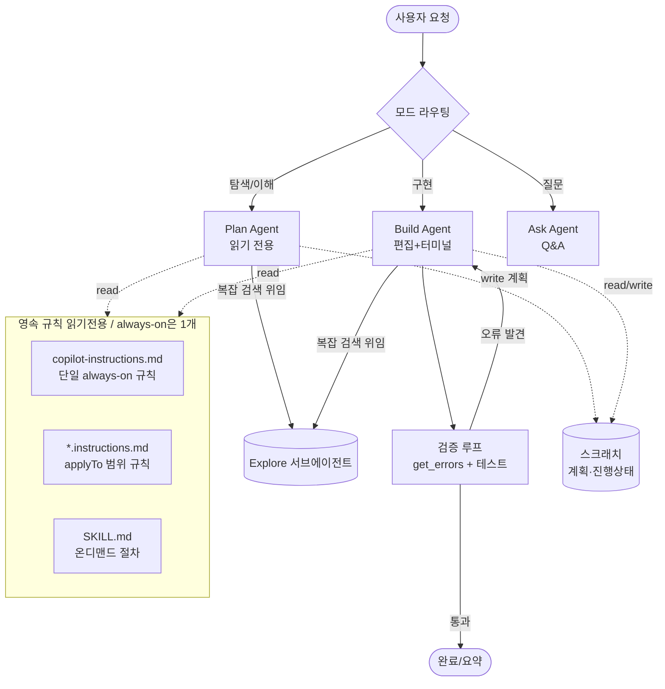
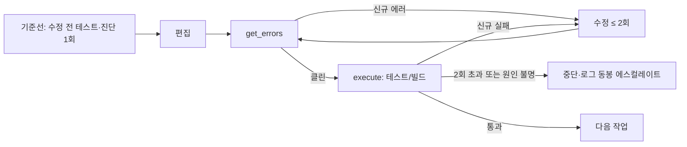

# GHCP 하네스 설계서 (Design Blueprint)

> 입력: [01-harness-research.md](01-harness-research.md)의 베스트 아이디어 종합
> 목표: GitHub Copilot(VS Code Agent) 위에서 **상위 하네스들의 강점을 조립형으로 재현**하는 하네스

---

## 1. 설계 원칙

GHCP는 자체 에이전트 루프·도구·승인 UX를 이미 갖췄다. 따라서 우리는 **새 런타임을 만들지 않고**, GHCP의 커스터마이징 레이어(`*.agent.md`, `*.instructions.md`, `SKILL.md`, 메모리, 서브에이전트)를 이용해 하네스를 "설정"으로 구축한다.

| # | 원칙 | 출처 패턴 |
| --- | --- | --- |
| P1 | **탐색 먼저, 변경은 나중** | cline Plan/Act, opencode plan |
| P2 | **모델을 위한 최소 도구** (ACI·미니멀리즘) | SWE-agent, mini-swe-agent |
| P3 | **프로젝트 메모리를 표준 파일로** | AGENTS.md/copilot-instructions 수렴 |
| P4 | **안전망: 승인·체크포인트·검증 루프** | cline, codex, aider |
| P5 | **무거운 탐색은 서브에이전트로 격리** | opencode @general |
| P6 | **자기 수정 루프**(오류→수정) | aider lint/test |
| P7 | **검증 = 패치 + 컨테이너 테스트를 북극성으로** | SWE-bench eval 하네스 |
| P8 | **작업별 모델 선택(라우팅)** | claude-code-router |

> **미니멀리즘이 원칙**: mini-swe-agent가 100줄·bash-only로 SWE-bench Verified >74%를 낸다. 따라서 우리 하네스도 "더 많은 레이어"가 아니라 **얼마나 간결한 규칙으로 동작하는가**를 우선한다(P2 강화).

---

## 2. 아키텍처 개요



핵심: **3개 모드(Plan/Build/Ask) + Explore 서브에이전트 + 검증 루프 + 규칙 3종**. 영속 규칙(읽기전용)과 휠발성 스크래치(계획·진행상태)를 분리한다 — 에이전트는 always-on 규칙에 쓰지 않고(C2), 계획은 스크래치에만 기록한다.

---

## 3. 컴포넌트별 설계

### 3.1 모드(에이전트) 분리 — `*.agent.md`

cline의 Plan/Act, opencode의 build/plan을 GHCP 커스텀 에이전트로 구현한다. 핵심은 **도구 허용 목록(`tools`)과 서브에이전트 허용 목록(`agents`)으로 모드의 권한을 강제**하는 것. 아래 `tools` 값은 실제 VS Code/Copilot **tool alias**다.

| 에이전트 | 역할 | `tools` (실제 alias) | `agents` | 편집 |
| --- | --- | --- | --- | --- |
| **Plan** | 코드베이스 이해·전략 수립 | `[read, search, web, agent]` | `[Explore]` | ❌ (edit/execute 없음) |
| **Build** | 구현·수정 | `[read, search, edit, execute, todo, agent]` | `[Explore]` | ✅ |
| **Ask** | 빠른 Q&A | `[read, search, web]` | (없음) | ❌ |
| **Explore** | 읽기 전용 탐색 서브에이전트 | `[read, search]` | `[]` (재위임 금지) | ❌ |

> 도구는 `tools`에 없으면 쓸 수 없고, 존재하지 않는 도구는 무시된다. 따라서 **edit/execute를 넣지 않는 것만으로 Plan의 읽기 전용성이 구조적으로 강제**된다(P1, P4). 모드 전환은 사용자 명시 또는 Plan→Build `handoffs`(객체 형식: `label`/`agent`/`prompt`/`send`)로.
>
> **타깃 환경**: 이 에이전트들은 `target: vscode`로 선언한다(VS Code Copilot 에이전트 대상). GitHub.com 클라우드 코딩 에이전트(`target: github-copilot`)는 도구 지원·`handoffs` 동작이 다를 수 있으므로, 클라우드로 옮길 때는 별도 검증이 필요하다.

#### 타깃별 호환성 (VS Code vs 클라우드)

`target`의 유효 값은 `vscode` 또는 `github-copilot` 둘 중 하나다(`target: cloud` 같은 값은 잘못된 값). 아래는 주요 필드·도구의 동작 차이다.

| 항목 | `target: vscode` | `target: github-copilot` (클라우드) |
| --- | --- | --- |
| `web` | 유효 | 현재 적용 보장 안 됨 — 별도 검증 필요 |
| `todo` | 유효 | 현재 적용 보장 안 됨 — 별도 검증 필요 |
| `handoffs` | 채팅 UI 버튼 워크플로 유효 | 비대화형 실행이라 ignored될 수 있음 |
| `mcp-servers` | 해당 없음 | 클라우드 전용 필드 |

> 근거: 공식 문서상 "도구가 `tools`에 없으면 무시된다"고 하며, `handoffs`는 응답 완료 후 나타나는 **채팅 UI 버튼**으로 정의된다. 따라서 클라우드 지원은 동일 파일 재사용이 아니라 **별도 `.agent.md` 분리 또는 검증 후** 진행한다(로드맵은 §7).

### 3.2 도구 전략 — ACI 적용 (P2)

SWE-agent의 교훈대로 **GHCP 내장 도구를 모델 친화적으로 "사용 규칙"화**한다(새 도구를 만드는 게 아니라 사용 패턴을 규정). alias 기준:

- 검색: 코드베이스 의미·정확 일치·파일명 모두 `search` alias로. 넓게 시작해 점진적으로 좌혀간다.
- 읽기(`read`)는 **넓은 범위 한 번**으로(작은 read 반복 금지).
- 편집(`edit`)은 다중 편집 시 일괄 적용 도구 우선.
- 터미널(`execute`)은 **병렬 호출 금지**, 한 번에 하나.

### 3.3 컨텍스트 관리 — Repo Map 근사 (aider 패턴)

GHCP엔 tree-sitter repo map이 없으므로 **2단계 근사**로 대체:
1. `search`(의미 검색)로 관련 영역의 스켈레톤/후보 파일 확보.
2. `search`(정규식 alternation 텍스트 검색)로 심볼·정의·호출부를 한 번에 좀힘.
3. 큰 파일은 개요를 먼저, 그 다음 타깃 범위만 `read`.

### 3.4 서브에이전트 — Explore 격리 (P5)

opencode `@general`처럼, **불확실하거나 광범위한 탐색을 Explore 서브에이전트로 위임**해 메인 컨텍스트를 깨끗이 유지한다. 구현은 `runSubagent` 같은 가상 호출명이 아니라 **VS Code 표준 방식**으로:

- 호출측(Plan/Build): frontmatter에 `tools: [..., agent]` 포함 + `agents: [Explore]` allowlist로 **Explore만** 호출 가능.
- 수행측(Explore): `*.agent.md`에 `tools: [read, search]`(읽기 전용), `user-invocable: false`(피커에서 숨김), `agents: []`(재위임 금지)로 정의.
- 호출 시 "무엇을·정밀도(quick/medium/thorough)·반환 형식"을 명시(근거: Anthropic 멀티에이전트 — 서브에이전트엔 목표·출력형식·경계가 모두 필요).

> ⚠️ **코드 작성은 절대 위임하지 않는다**(상세 근거는 [03-synergy-conflict-design.md](03-synergy-conflict-design.md) C3·§5). Explore는 read-only 탐색·질문 전용, 쓰기는 메인 단일 스레드가 독점.

### 3.5 안전망 (P4)

- **승인 게이트**: 비가역/공유 영향 작업(push, force, reset --hard, 파일 삭제, 인프라 변경)은 사용자 확인.
- **체크포인트/Undo**: VS Code 변경 추적 + Git 커밋 경계로 롤백 지점 확보.
- **샌드박스 마인드셋**(codex): 셸은 영향 범위를 설명하고 실행.

### 3.6 검증 루프 (P6·P7, aider · SWE-bench)

Build가 편집할 때마다:


**반복 상한 원칙**(근거: Anthropic "effective agents" — 무한 자가수정 금지):
1. 수정 전 **기준선**을 먼저 잡는다(테스트·진단 1회 실행). 이미 깨져 있던 실패(pre-existing)는 **건드리지 않고** 기록만 한다.
2. 내 변경이 유발한 **신규 실패**만 고친다.
3. 같은 실패에 대한 자가수정은 **최대 2회**. 그래도 안 되면 동일 접근 반복을 멈추고 **로그·diff·시도한 가설을 동봉해 에스컬레이트**(C8: 검증-자율성 충돌 완화).

> **북극성 = SWE-bench 방식의 검증**: 단순히 "컴파일되는가"가 아니라 **(1) 변경을 패치/diff로 명확히 하고 (2) 관련 테스트를 실제로 돌려 통과하는지**로 완료를 정의한다. 테스트가 없으면 "재현 → 수정 → 회귀 방지 테스트 추가"를 기본 절차로 삼는다.

### 3.7 메모리 표준 (P3)

**핵심 결정 — 항상 로딩(always-on) 파일은 딱 하나만.** 레포 전역 규칙을 담는 "항상 주입" 파일은 `.github/copilot-instructions.md` **또는** 루트 `AGENTS.md` 중 **하나만** 쓴다. 둘 다 두면 중복·충돌하는 문서화된 안티패턴이다.

- 이 프로젝트는 **Copilot 하네스**이므로 공식 권장값인 `.github/copilot-instructions.md`를 단일 always-on 파일로 채택. (`AGENTS.md`는 도구 간 이식성이 필요할 때의 대안 — 하지만 둘을 동시에 두지 않는다.)
- 그 파일에는 **변하지 않는 최소 불변용 규칙**만 넣는다(서브에이전트 읽기전용, 경계에서 라우팅, 로드베어링 컨텍스트 보호, 검증 루프 상한, 커밋 경계). 길어지면 매 턴 컨텍스트를 태운다.
- 나머지 지식은 **역할별로 분리**해 접근성(scoping)으로 컨텍스트를 아낀다.

| 파일 | 적용 방식 | 용도 |
| --- | --- | --- |
| `.github/copilot-instructions.md` (단일) | **항상 로딩** | 레포 전역 불변용 규칙(최소한). 빌드·테스트 명령, 안전 경계 |
| `*.instructions.md` (`applyTo`) | 경로/언어 glob 매칭 시만 | 해당 파일군에만 적용되는 규칙(TS·테스트·문서 등) |
| `SKILL.md` | 온디맨드(모델/사용자 호출) | 자주 쓰는 절차(테스트 디버그·릴리스 체크리스트 등) |

> 계획·진행상태 같은 **휠발성 메모**는 always-on 파일에 넣지 않는다. 이는 세션 컨텍스트·스크래치(예: PR 설명, 임시 노트)로 따로 관리(근거: [03](03-synergy-conflict-design.md) C2).

### 3.8 라우팅·모델 선택 (P8, claude-code-router)

claude-code-router처럼 **작업 성격에 따라 모델을 고르는 것**도 하네스의 차원이다. GHCP에서는 별도 라우터를 만들지 않고 **모델 피커 + 에이전트별 권장 모델**로 근사한다.

| 시나리오 | 성격 | 권장 모델 선택 기준 |
| --- | --- | --- |
| `think` | 설계·난이도 높은 추론 | 추론이 강한 고성능 모델 |
| `longContext` | 대형 코드베이스·긴 로그 | 대컨텍스트 모델 |
| `background` | 반복·저비용 작업(포맷·린트) | 빠르고 저비용 모델 |
| `default` | 일반 구현 | 균형 모델 |

> 원칙: "한 모델로 전부"가 아니라 **비용·속도·추론력을 작업에 맞게 교환**. Plan/think는 고추론, Build/background는 실속 모델로 분할하면 품질·비용 균형이 좋아진다.

**에이전트 → 라우팅 클래스 매핑** (각 `*.agent.md`의 `model:`로 표현):

| 에이전트 | 라우팅 클래스 | 모델 포스처 |
| --- | --- | --- |
| Plan | `think` | 추론 강한 모델 우선(`model:` 배열 1순위) |
| Build | `default` | 균형 모델(구현·검증) |
| Ask | `default`(경량 쪽) | 빠른 응답 우선 |
| Explore | `background` | 핀 없이 피커 기본값 — 읽기전용 대량 탐색이라 저비용으로 |

> 주의: 라우팅은 **작업 경계에서만**(C4) — 한 작업 도중 모델을 갈아타지 않는다. 사용 가능한 모델이 제한적이면 Plan·Build가 같은 모델을 공유해도 무방하며(임의 분할 금지 — 근거 있는 분할만), 선택지가 늘면 위 클래스대로 특화한다. Explore가 핀을 두지 않는 것이 이 매핑의 실제 표현이다.

## 4. 시스템 프롬프트 골격 (모드별 공통 + 차등)

> [system-prompts 모음](https://github.com/x1xhlol/system-prompts-and-models-of-ai-tools)에서 관찰된 베스트 프랙티스를 GHCP 톤에 맞춰 구조화.

공통 블록:
1. **역할·범위** — 무엇을 하고 무엇을 안 하는지.
2. **도구 사용 규칙** — 위 3.2의 우선순위·금지사항.
3. **작업 추적** — 다단계는 `todo`(작업 목록)로, 한 번에 하나 in-progress.
4. **소통 스타일** — 간결, 파일 링크 규칙 준수.
5. **메모리 참조** — 시작 시 단일 always-on 파일(`copilot-instructions.md`)와 적용 범위의 `*.instructions.md` 확인.

모드 차등:
- Plan: "절대 파일을 수정하지 말 것. 산출물은 단계별 실행 계획."
- Build: "편집 후 반드시 검증 루프(3.6) 수행."
- Ask: "코드 변경 없이 근거와 함께 답변."

---

## 5. 리포지터리 구조 (구현)

실제 커스터마이제이션 파일은 **모두 `.github/` 아래**에 둔다(VS Code/Copilot 표준 인식 경로). 루트 `agents/`·`instructions/`·`skills/`는 인식되지 않는다.

```
harness/
├─ docs/
│  ├─ 01-harness-research.md         # 리서치
│  ├─ 02-ghcp-harness-design.md      # 본 설계서
│  └─ 03-synergy-conflict-design.md  # 조합 설계(시너지·충돌)
├─ .github/
│  ├─ copilot-instructions.md         # 단일 always-on 전역 규칙
│  ├─ agents/                          # 모드별 커스텀 에이전트
│  │  ├─ plan.agent.md
│  │  ├─ build.agent.md
│  │  ├─ ask.agent.md
│  │  └─ explore.agent.md             # 읽기전용 서브에이전트(user-invocable:false)
│  ├─ instructions/                    # applyTo 범위별 규칙
│  │  ├─ typescript.instructions.md
│  │  ├─ tests.instructions.md
│  │  └─ docs.instructions.md
│  └─ skills/                          # 온디맨드 절차
│     ├─ test-debugging/SKILL.md
│     └─ release-checklist/SKILL.md
└─ examples/
   └─ scenarios.md                     # 드라이런 시나리오
```

---

## 6. 비교 요약: 우리 하네스가 취하는 것

| 아이디어 | 출처 | 채택 방식(GHCP) |
| --- | --- | --- |
| Plan/Act 모드 | cline, opencode | `plan.agent.md` / `build.agent.md` (도구 제한) |
| 페르소나 모드 | Roo-Code | Ask + 향후 커스텀 에이전트 확장 |
| ACI·미니멀 도구 | SWE-agent | 내장 도구 사용 규칙화 |
| Repo Map | aider | semantic + grep 2단계 근사 |
| 서브에이전트 | opencode | `agent` alias + `agents: [Explore]` allowlist |
| 체크포인트 | cline | VS Code 변경추적 + Git |
| 검증 루프 | aider | 진단(get_errors) + `execute` 테스트(반복 상한 2회) |
| 메모리 표준 | AGENTS.md 수렴 | 단일 always-on(`copilot-instructions.md`) + instructions + SKILL |
| 승인·샌드박스 | codex | 비가역 작업 확인 정책 |
| 라우팅·모델 선택 | claude-code-router | 모델 피커 + 에이전트별 권장 모델(3.8) |
| eval 검증 | SWE-bench | 패치+컨테이너 테스트를 완료 기준으로(3.6) |
| CI 하네스 | claude-code-action | (향후) GitHub Actions 연동 확장 |

---

## 7. 다음 단계(구현 로드맵)

1. ✅ `.github/agents/plan.agent.md`, `build.agent.md`, `ask.agent.md`, `explore.agent.md` 작성(도구·서브에이전트 허용 목록 포함).
2. ✅ `.github/copilot-instructions.md`에 검증 루프·도구 규칙·소통 스타일을 단일 always-on 파일로 명문화.
3. ✅ 대표 작업(버그 수정·기능 추가·대형 리팩터링·테스트 디버그·문서)을 [examples/scenarios.md](../examples/scenarios.md)에 드라이런으로 정리.
4. ✅ 자주 쓰는 절차를 `.github/skills/`로 추출.
5. ✅ 경로별 `.github/instructions/*.instructions.md` 추가.
6. (향후 확장) **CI 하네스**: claude-code-action처럼 PR/이슈에서 트리거되는 자동 리뷰·구현을 GitHub Actions(또는 Copilot coding agent)로 연동.

> 1~5번은 본 레포의 `.github/`·`examples/`에 구현 완료. 설계→구현 추적성을 위해 각 파일은 본 설계서의 원칙(P1~P8)과 [03](03-synergy-conflict-design.md)의 충돌 해소책(C1~C12)을 근거로 한다.
